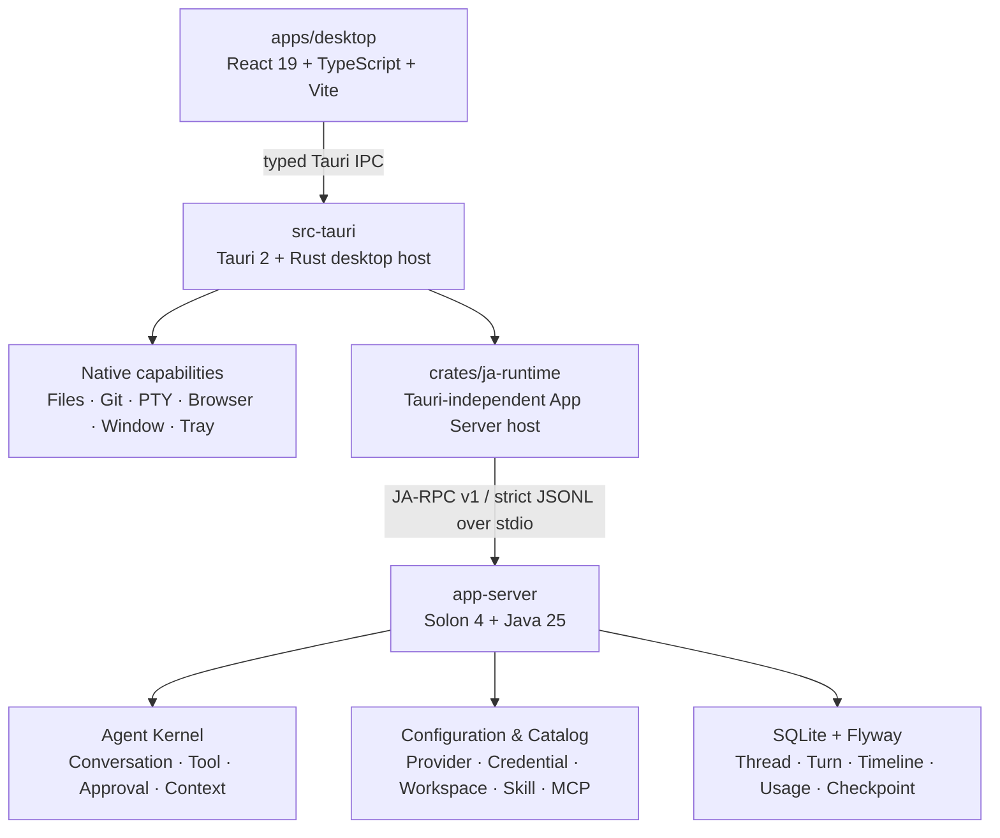

<!-- @author kongweiguang -->

<div align="center">
  
  <h1>Ja（驾）</h1>
  <p><strong>驾驭 Harness（马具）。</strong></p>
  <p>基于 Solon 4 + Java 25 的本地 Agent Harness，统一掌控模型、Tools、Skills、MCP、上下文、审批与持久化。</p>
  <p>
    <a href="https://github.com/kongweiguang/ja/releases">下载 Ja</a>
    ·
    <a href="#快速开始">快速开始</a>
    ·
    <a href="#当前能力">当前能力</a>
    ·
    <a href="#架构">架构</a>
    ·
    <a href="https://github.com/kongweiguang/ja/issues">问题反馈</a>
  </p>
  <p><sub>v0.1.0 Preview · Windows 11 / macOS 目标平台 · GPL-3.0-or-later</sub></p>
</div>

Ja（驾）取“驾驭”之意。Harness 本义是用于驾驭的“马具”，在 Agent 领域则指驱动、约束并承载模型执行的框架。Ja 基于 Solon 4 + Java 25 实现这套 Harness，把模型推理、Agent Loop、工具生态、上下文预算、权限边界与状态恢复组织成完整 Turn。你可以看到模型正在做什么、决定 Tool 是否执行、检查能可靠归因到本轮的文件变化，并在同一个窗口中继续编辑、运行和审查。

Ja 不要求绑定项目。通用对话使用 Ja 管理的本地工作区；需要处理真实代码时，再显式打开并信任一个本地目录。对话、配置和运行记录默认保存在本机，只有模型请求、Streamable HTTP MCP 与浏览器访问会连接到你主动配置的网络地址。

> Ja 仍处于预览阶段。安装包类型与可用平台以 [GitHub Releases](https://github.com/kongweiguang/ja/releases) 中的实际产物为准；升级前请保留重要项目和 `%USERPROFILE%\.ja` / `~/.ja` 数据备份。

## 为什么是 Ja（驾）

“驾”与 Harness（马具）构成品牌双关，也对应 Ja 的产品职责：模型负责推理下一步，Harness 负责让每一步真正可执行、可约束、可恢复。Ja App Server 内基于 Solon 4 + Java 25 的 Agent Kernel 是这套 Harness 的唯一业务核心；Tauri 2 与 Rust 绑定文件、Git、PTY、Browser 和桌面生命周期，React 则把权威状态投影为可交互的工作台。

| Harness 维度   | Ja 当前实现                                                                                      |
| -------------- | ------------------------------------------------------------------------------------------------ |
| Agent Loop     | Turn 准入、流式模型轮次、Tool 循环、预算、取消、唯一终态与失败恢复                               |
| 模型与上下文   | Anthropic Messages / OpenAI Chat Completions / OpenAI Responses、请求级运行环境、Usage 计量、Checkpoint 与自动/手动压缩 |
| Tools 与扩展   | 内置文件和 Shell Tools、通用/用户/可信项目三层 Skills、`stdio` / Streamable HTTP MCP             |
| 权限与约束     | 工作区信任、项目级收紧、Tool 逐次审批、路径 containment、Secret 非回显                           |
| 持久化与可审查 | SQLite 持久化 Thread、Turn、Timeline、Tool、Approval、Usage、Checkpoint 与已提交 ChangeSet       |
| 原生桌面工作台 | 对话、Files、Review、Terminal 与 Browser 协同，执行状态和结果在同一条 Timeline 中闭环            |

## 当前能力

### Agent 对话

- 流式 Markdown 回复，公开的 reasoning summary 与最终答复分区呈现，不展示隐藏 Chain-of-Thought。
- 工作过程按真实 Tool 状态原位推进；运行时展开，成功后收起，失败、取消或等待确认时保留现场。
- 支持停止当前 Turn，以及在 Turn 运行期间选择“立即引导”或“后续消息”，无需等待当前回复结束。
- Tool 执行可直接放行，也可逐次批准或拒绝；重启后仍能恢复待处理审批与已完成步骤。
- 首问会立即生成可读短标题；首次成功回复后，后台任务会在实际请求前读取最新模型环境并生成一次语义标题，人工重命名始终优先。
- Thread、Turn、消息、Tool、审批、Usage 与上下文 Checkpoint 持久化到 SQLite，可在重启后恢复。
- 模型真实 Usage 可用时显示上下文占用；支持自动压缩和空闲对话的手动“压缩上下文”。
- 能可靠归因的本轮文件变化以已提交 ChangeSet 呈现在最终答复之后；并发 Turn、非 Git 或捕获失败时不伪造“零修改”，也不用随后可能漂移的工作树冒充历史结果。

### 模型与 Provider

当前只保留三条显式模型协议：`Anthropic Messages`、`OpenAI Chat Completions` 与 `OpenAI Responses`。
Provider 是用户自定义连接，不设置 OpenAI、Anthropic 或 DeepSeek 品牌类型；名称只负责显示和模型分组，
请求结构、鉴权与响应 Usage 解析全部由所选 API 规范决定，不从名称猜测或自动回退协议。

- 一个 Provider 可以保存多个模型，并配置自定义名称、Base URL、独立 `credential_id`、网络超时、上下文窗口、最大输出和推理强度映射；包括名为 DeepSeek 的配置在内，不同 Provider 都不共享或覆盖彼此的 API Key。
- Composer 按 Provider 分组展示真实上游模型标识；Provider 只负责分组，不冒充模型名。
- 模型、推理强度和执行确认属于 Thread 偏好；在途 Provider 请求保持不变，下一次 Provider 请求发送前读取最新偏好并静默生效。
- “验证模型”会在用户确认后发起一次有界真实请求，只显示响应模型与耗时，不保存回答。该操作可能产生少量费用。
- 请求前只对本次即将发送的完整 Provider envelope 做本地保守 Token 预算，不调用供应商 Token Count API；请求先登记带完整 Profile 的 UNKNOWN Usage，正式响应返回可靠计量后原位结算为 KNOWN，缺失时保持未知而不是伪造为 0。
- 不在请求失败时自动回退到另一协议或另一个 Provider。

### 附件与上下文

- Composer 可通过原生文件选择器添加附件；每轮最多 10 个文件，单文件最多 100 MiB，合计最多 250 MiB。
- 文本附件由 Agent 通过受控 reader 分段读取；受支持的上游模型可原生接收 JPEG、PNG、GIF、WebP 与 PDF。
- 模型或 Provider Codec 不支持原生媒体时，附件回退为受控 `read_attachment` Tool，不会假装模型已经理解内容。
- 附件进入 Ja 的内容寻址存储，Timeline 只展示名称、媒体类型和有界大小，不暴露原始绝对路径。
- 自动压缩在发送前按完整 Provider 请求预算决策；手动压缩只处理空闲 Thread，并明确报告成功、无需压缩或失败。

### 项目工作台

右侧工作台默认关闭，由标题栏显式打开。它包含四个真实能力，隐藏面板不会终止仍在运行的 Terminal 或 Browser，显式关闭、切换工作区或退出应用才会释放对应资源。

#### Files

- Rust 权威读取的文件树、分页目录、工作区搜索、多标签 CodeMirror 编辑器和自动保存。
- 新建、重命名、移动、另存为、外部打开、从系统拖入和移入回收站。
- 保存使用 SHA-256 CAS 与同目录原子替换；外部修改与本地草稿冲突时可比较、重新加载或另存为，不静默覆盖。
- 路径始终限制在当前工作区；symlink、reparse point 与未知特殊节点保留真实类型并以只读方式展示。

#### Review

- `未暂存`、`已暂存`、`分支`、`提交`四类 Git 来源。
- 统一或并排 Diff，按文件懒加载，并可复制统一 Diff。
- 未暂存与已暂存来源按实际能力执行暂存、取消暂存或撤销；分支和提交只读。
- 所有变更动作都校验 opaque revision 与文件身份，过期视图要求刷新，不提供强制覆盖。

#### Terminal

- 只展示系统实际探测成功的受控 Shell profile；Windows 默认 profile 优先 PowerShell 7，必要时回退 Windows PowerShell 5.1，也可显式选择探测成功的 CMD。
- 支持标签页、横向/纵向分屏、拖拽调整比例、进程退出后重启，以及工作区相对目录。
- 每个 Terminal Tab 最多 4 个 pane，每个工作区最多 8 个 live pane。
- 重启只恢复布局、Shell profile 与相对目录，不持久化命令、环境、scrollback 或旧 session identity。

#### Browser

- 在与主界面隔离的 Tauri child WebView 中预览本地开发服务或外部网页。
- 只接受经过校验的 `http://` 与 `https://` 地址；文件路径、自定义协议、userinfo 与危险 URL 被拒绝。
- Open、navigate、watchdog、事件和 close 都绑定 session generation，旧回调不能污染新会话。

### Skills 与 MCP

Ja 会发现以下 Skill 来源：

| 来源              | 目录                                             |
| ----------------- | ------------------------------------------------ |
| 通用 Agent Skills | `~/.agents/skills/<skill-name>/SKILL.md`         |
| Ja 用户 Skills    | `~/.ja/skills/<skill-name>/SKILL.md`             |
| 当前可信项目      | `<project>/.agents/skills/<skill-name>/SKILL.md` |

- 设置中可以查看 Skill 来源、状态并启停；未信任项目的工作区 Skill 不进入 Turn。
- MCP 支持 `stdio` 与 `Streamable HTTP`，可以启停、测试连接、查看 Tool Schema 和删除配置。
- 打开、信任或刷新 Workspace 不启动 MCP；首次 Provider 请求按需发现目录，`tools/list_changed` 只使目录失效并在下一请求安全点有界刷新。
- MCP Secret 通过 credential ref 注入，不应写进 URL、参数、Header 列表或普通环境配置。
- 当前不提供远程 OAuth 流程；Streamable HTTP 远程地址必须使用 HTTPS，本机 loopback 可以使用 HTTP。
- 设置页只编辑全局配置。可信项目仍可通过 `<project>/.ja/config.toml` 继承或停用全局能力，不能扩权。

### 桌面体验

- Windows 自绘标题栏、单实例、系统托盘、窗口状态恢复和完整退出握手。
- 点击关闭按钮或按 `Alt+F4` 只隐藏到托盘；只有托盘中的“退出 Ja”会清理 Files、Terminal、Browser 与 Ja App Server 后结束进程。
- 浅色、深色、跟随系统、减少动效、提高对比度与可选桌面通知。
- 通知仅在窗口不活跃时显示固定的完成、失败或待确认摘要，不包含对话正文、命令、路径或凭据。
- 对话搜索、命令面板、键盘导航、可调左右栏和窄窗口抽屉布局。

## 快速开始

### 1. 安装并启动

从 [GitHub Releases](https://github.com/kongweiguang/ja/releases) 选择当前版本实际提供的 Windows NSIS（`.exe`）或 macOS DMG（`.dmg`）。Ja 不使用系统代码签名证书，Windows 可能显示 SmartScreen 提示，macOS 可能要求在“隐私与安全性”中批准打开；应用更新仍验证独立的 Tauri 更新签名。普通 CI 冒烟产物不代表已发布版本，请使用 Release 中的完整产物和校验和。

Ja 首次启动会在当前用户目录创建 `~/.ja`，不要求注册 Ja 账号。

### 2. 配置模型

首次启动会进入“设置 → 模型”：

1. 点击“新增 Provider”，填写服务商名称、服务商、原生接口、Base URL、首个模型名称和真实上游模型标识。
2. 保存后打开该 Provider 的连接设置，在“系统凭据库”中一次性输入 API Key 或 Token，并点击“保存或替换密钥”。
3. 按需编辑模型的上下文窗口、最大输出和推理强度映射；自定义模型默认从 text-only 能力开始。
4. 点击“验证模型”，阅读费用提示并确认。验证成功只证明这次 endpoint、credential 与模型请求可用，不等于完整对话、Tool 或附件链路已经验收。

密钥保存后不会回显。以后不需要重复输入；只有明确执行“保存或替换密钥”或“删除凭据”才会改变它。

### 3. 选择工作区

- **无项目对话**：使用 Ja 在 `~/.ja/data/general-workspace` 中管理的真实本地工作区，适合通用任务，同样可以使用 Files、Terminal 与 Browser；目录不是 Git 仓库时 Review 会如实显示非仓库状态。
- **项目对话**：从左侧“项目”添加本地目录。Ja App Server 规范化路径、生成稳定 Workspace identity 并保存信任状态，Rust 再把该 identity 绑定到文件、Git、PTY 与 Browser 能力。

设置页始终展示并编辑真实全局默认值。项目层是全局设置之上的稀疏覆盖：可以选择全局已有模型、停用 Skill/MCP 或把“全部执行”收紧为“需要确认”，但不能新增能力或扩大权限；它保存在受信任工作区的 `.ja/config.toml`，由 Ja App Server 合并，不在设置页提供项目入口。

### 4. 开始协作

新建对话后，建议在请求中写清：

- 目标文件、模块或现象；
- 期望结果与不能改变的边界；
- 是否允许修改文件、执行命令或改变 Git 状态；
- 需要运行的验证与验收方式。

运行中可以查看工作过程、展开 Tool 结果、处理审批或停止 Turn。还要补充方向时选择“立即引导”；希望当前 Turn 完成后再处理时选择“后续消息”。

### 5. 检查结果

1. 先阅读最终答复以及其后的本轮文件修改卡。
2. 打开持久化 Turn Diff，确认它记录的是本轮已提交结果。
3. 再进入 Review 检查当前工作树，必要时暂存、取消暂存或撤销。
4. 在 Files 中处理冲突与草稿，在 Terminal 中运行项目验证，在 Browser 中检查本地服务。

Turn ChangeSet 与 Review 的职责不同：前者回答“这一轮可靠归因了哪些文件变化”，后者回答“工作区现在是什么状态”。

## 架构



生产调用链固定为：

```text
apps/desktop -> src-tauri -> crates/ja-runtime -> app-server
```

| 层              | 唯一责任                                                                       | 不拥有的事实                                                        |
| --------------- | ------------------------------------------------------------------------------ | ------------------------------------------------------------------- |
| React 桌面层    | UI 投影、草稿、选择状态与可逆交互意图                                          | 不读 `config.toml` / `auth.json`，不生成 Workspace ID，不拼配置快照 |
| Rust/Tauri Host | App Server 生命周期、文件/Git/PTY/Browser、窗口、托盘、通知与最小 Capability   | 不实现 Agent、配置、Thread/Turn 或 SQLite 业务规则                  |
| `ja-runtime`    | 与 Tauri 解耦的 sidecar 进程、严格 JA-RPC 编解码、超时、事件队列与关闭         | 不暴露任意 RPC，也不持有桌面 UI 状态                                |
| Ja App Server   | 配置、凭据、Workspace identity、Agent Kernel、Provider、Skill/MCP 与持久化业务 | 不直接操作 React，也不接管桌面窗口和原生工作台                      |
| SQLite/Flyway   | Thread、Turn、消息、Tool、审批、Usage、附件元数据、Checkpoint 与恢复事实       | 不保存 Secret、原始隐藏 reasoning 或任意宿主对象                    |

### 架构不变量

- Ja App Server 是业务事实的唯一 owner；Rust 只代理 JA-RPC 并绑定原生能力，React 只消费严格投影。
- 每次 Provider 请求发送前解析当前 Provider、Model、Credential、Skill、MCP、Prompt 与执行确认模式；只有已经发送的请求和已经生成并持久绑定的 Tool batch 保持原环境，随后请求采用最新配置。
- JA-RPC v1 使用严格方法闭集、DTO、错误目录和事务事件。App Server stdout 只写 JSONL 协议帧，诊断进入 stderr 或滚动日志。
- 产品版本以根 `package.json` 为唯一权威；`pnpm version:sync` 同步 Java、Cargo 和桌面元数据，`pnpm version:check` 只读校验一致性。数据库只包含直接创建当前完整模型的 V1，不支持开发期数据升级。
- SQLite 先提交领域事务，再发布带 revision 的事件；重连、事件 gap 或投影异常时客户端重读权威快照。
- 文件写入、Git mutation、PTY、附件与 Browser 都经过 identity、路径 containment、容量、超时和 cleanup 边界。
- 当前架构不保留旧 API、旧字段、旧目录或双轨兼容层。

更详细的实现合同：

- [桌面工作台](.updeng/docs/business/desktop-ui/README.md)
- [对话与 Turn 生命周期](.updeng/docs/business/conversation/README.md)
- [配置、凭据与代际](.updeng/docs/business/configuration/README.md)
- [Ja App Server 与 Agent Kernel](.updeng/docs/business/ja-agent-kernel/README.md)
- [JA-RPC v1](.updeng/docs/integrations/ja-rpc/README.md)
- [模型 Provider 集成](.updeng/docs/integrations/model-providers/README.md)

## 执行确认与安全

“设置 → 执行确认”提供两个真实模式：

| 模式                 | 行为                                       |
| -------------------- | ------------------------------------------ |
| **全部执行（默认）** | 内置 Tool 与 MCP Tool 直接执行，不逐次确认 |
| **需要确认**         | 每次执行内置 Tool 或 MCP Tool 前请求批准   |

“全部执行”继承 Ja 桌面进程当前用户的文件与命令权限。首次打开陌生项目或连接新的 MCP Server 时，建议先使用“需要确认”。审批不能替代 Git、最小权限和备份。

其它关键边界：

- 项目目录必须由用户显式选择并信任；工作区路径、symlink/reparse escape 与外部文件变化都在原生边界校验。
- API Key 与 Token 只通过 credential set/delete 流程修改，不进入普通设置快照、React 状态、JA-RPC 结果或日志。
- Tool 卡只接收脱敏 `ToolPresentation`，不把 raw arguments、raw result、绝对路径或 Secret 发送到 WebView。
- 模型请求会发送当前 Turn 必需的 System、会话上下文、Tool Schema 与已绑定附件；具体数据处理同时受所选 Provider 政策约束。
- `stdio` MCP 在本机启动进程，Streamable HTTP MCP 和 Browser 会访问配置的网络地址。

## 本地数据与隐私

Ja 的固定用户目录是 Windows 的 `%USERPROFILE%\.ja`，macOS 可写作 `~/.ja`。

| 路径                                     | 内容                                                  |
| ---------------------------------------- | ----------------------------------------------------- |
| `config.toml`                            | Provider、模型、Skills、MCP、执行确认与外观等全局设置 |
| `auth.json`                              | 本地凭据库；受权限约束且不会通过设置读取回显          |
| `trusted-workspaces.json`                | 已确认的工作区信任记录                                |
| `data/ja.db`                             | Workspace、Thread、Turn、Timeline、Usage 与恢复状态   |
| `data/attachments/blobs/`                | 内容寻址的受管附件正文                                |
| `data/general-workspace/`                | “无项目对话”使用的受管本地工作区                      |
| `skills/`                                | Ja 用户 Skills                                        |
| `logs/`                                  | Rust Host 与 Ja App Server 的脱敏滚动日志             |
| `backups/`、`cache/`、`run/`、`exports/` | 恢复副本、可重建缓存、短生命周期状态与用户导出        |

- Ja 本身不要求登录账号，项目文件和历史默认留在本机。
- 不要提交、公开或未经保护地同步 `auth.json`、私有源码、附件存储或未经脱敏的日志。
- Ja 的本地恢复副本服务于迁移和故障恢复，不替代 Git 与长期备份。

## 常用快捷键

| 操作               | Windows                            | macOS                             |
| ------------------ | ---------------------------------- | --------------------------------- |
| 显示/隐藏左侧栏    | `Ctrl+B`                           | `Cmd+B`                           |
| 新建对话           | `Ctrl+N`                           | `Cmd+N`                           |
| 搜索当前工作区对话 | `Ctrl+K`                           | `Cmd+K`                           |
| 命令面板           | `Ctrl+Shift+P`                     | `Cmd+Shift+P`                     |
| 打开 Review        | `Ctrl+Shift+G`                     | `Cmd+Shift+G`                     |
| 打开 Files         | `Ctrl+P`                           | `Cmd+P`                           |
| 打开 Terminal      | <kbd>Ctrl</kbd> + <kbd>&#96;</kbd> | <kbd>Cmd</kbd> + <kbd>&#96;</kbd> |
| 打开 Browser       | `Ctrl+T`                           | `Cmd+T`                           |
| 聚焦对话           | `Ctrl+Alt+S`                       | `Cmd+Option+S`                    |
| 打开设置           | `Ctrl+,`                           | `Cmd+,`                           |
| 后退/前进          | `Alt+Left` / `Alt+Right`           | `Cmd+[` / `Cmd+]`                 |

Workbench 快捷键在 CodeMirror、xterm 和 Preview 聚焦时仍由应用壳统一处理；普通输入快捷键不会抢占文本编辑。

## 常见问题

### 配置完成后仍无法对话

确认已经保存默认 Provider 与模型，并在 Provider 连接设置中保存凭据。随后执行“验证模型”；保存配置、端口可达或凭据显示“已配置”都不能替代一次成功的真实模型请求。

### MCP 已启用但显示“未检查”

“启用”只是配置状态。点击“测试”，再检查 Transport、Executable/URL、参数、认证引用与 Server 协议。当前不支持远程 OAuth。

### 无法切换项目或退出

先处理 Files 中的保存失败、外部冲突或恢复门禁。Ja 会先 flush 草稿并关闭 Terminal/Browser，再切换工作区或完成进程退出；任何 owner 无法确认清理时都会取消这次操作。

### 关闭窗口后进程仍在

这是当前桌面生命周期设计：标题栏关闭与 `Alt+F4` 只隐藏到系统托盘。需要结束进程时使用托盘菜单的“退出 Ja”。

### 无法压缩上下文

手动压缩只对空闲 Thread 开放。先等待当前 Turn 结束；预算估算在本地完成，但 Summary 仍会调用当前 Provider，因此依赖可用模型与凭据，也可能产生费用。

### 没有可用终端

Ja 只展示真实探测成功的受控 Terminal profile。Windows 默认 profile 会先尝试 PowerShell 7，再尝试 Windows PowerShell 5.1；CMD 是独立候选。Agent 的 Shell Tool 由 Ja App Server 另行预检，因此可能与交互式 Terminal 的可用集合不同；Shell Tool 不可用时仍保留文件 Tool。

### 到哪里查看运行日志

日志位于 `~/.ja/logs`。提交问题前只截取相关时间段并完成脱敏，不要上传 API Key、私有源码、完整 Prompt、命令输出或用户绝对路径。

## 开发与贡献

项目从仓库根目录工作，固定使用 Node.js 24.x、pnpm 10.33.0、Rust 1.89+ 与 JDK 25。环境、验证门禁和跨 Java/Rust/TypeScript 合同要求见 [CONTRIBUTING.md](CONTRIBUTING.md)。

目录职责：

| 目录                 | 内容                                           |
| -------------------- | ---------------------------------------------- |
| `apps/desktop/`      | React/Vite 桌面前端                            |
| `src-tauri/`         | Tauri 壳、原生桌面能力与组合根                 |
| `crates/ja-runtime/` | Tauri-independent Ja App Server host runtime   |
| `app-server/`        | Solon 4 + Java 25 Ja App Server 与 Agent Kernel |
| `contracts/`         | JA-RPC v1 schema、错误目录与三端 golden corpus |
| `tests/contract/`    | Java、Rust、TypeScript 完整合同 Gate           |

## 反馈与许可

问题与建议请提交到 [GitHub Issues](https://github.com/kongweiguang/ja/issues)，并附上操作系统、Ja 版本、复现步骤、预期结果和已脱敏的错误信息。安全问题报告见 [SECURITY.md](SECURITY.md)。

Ja 以 GNU General Public License v3.0 or later（GPL-3.0-or-later）授权，详见 [LICENSE](LICENSE)。
