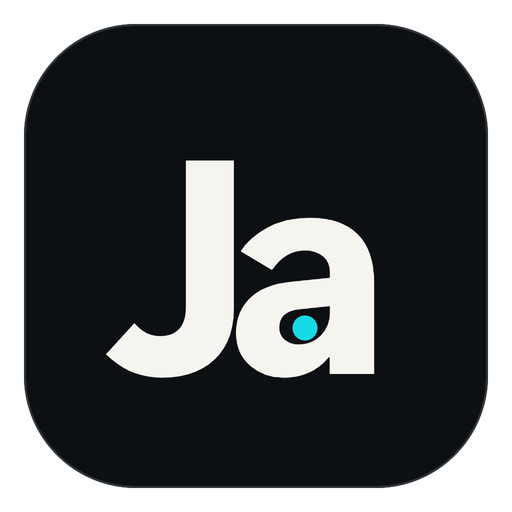

<!-- @author kongweiguang -->

  
  <h1>Ja</h1>
  
<strong>把 AI 对话、项目文件、代码审查、终端和网页预览放进同一个本地桌面工作台。</strong>

  
选择自己的模型服务，在真实项目目录中与 Agent 协作，并在执行前看清上下文、工具调用和代码变更。

  

    <a href="https://github.com/kongweiguang/ja/releases">获取版本</a>
    ·
    <a href="#快速开始">快速开始</a>
    ·
    <a href="#认识工作台">认识工作台</a>
    ·
    <a href="https://github.com/kongweiguang/ja/issues">问题反馈</a>
  

  
当前仓库版本 v0.1.0 · 预览阶段 · Windows / macOS 桌面应用

Ja 是一个本地优先的 AI 编程桌面应用。项目仍然是磁盘上的普通目录和文件，对话与工作区记录保存在本机；需要联网的内容只会发往你主动配置的模型服务、MCP Server 或浏览器地址。

Ja 不绑定某一家模型平台。当前原生支持 OpenAI Responses、OpenAI Chat Completions 和 Anthropic Messages，可以为不同模型保存独立的上下文、执行上限、网络超时、Skills 与 MCP 组合。

> Ja 当前处于预览阶段，公开发布页尚无稳定安装包。正式版本会在 [GitHub Releases](https://github.com/kongweiguang/ja/releases) 提供；不要把未签名的 CI 冒烟产物当作正式安装包。

## 当前能力

| 领域           | 已实现能力                                                                                                       |
| -------------- | ---------------------------------------------------------------------------------------------------------------- |
| **Agent 对话** | 流式回复、Markdown 消息、工具执行过程、确认卡片、停止当前任务、会话历史与项目间恢复。                            |
| **模型配置**   | OpenAI 与 Anthropic 原生 API、自定义 Base URL、一次性 API Key 输入、活动模型切换，以及显式上下文/Turn/网络限制。 |
| **项目与文件** | 本地文件夹工作区、文件树、工作区搜索、多文件标签、代码编辑、自动保存、另存为、新建、重命名、拖入和系统回收站。   |
| **冲突保护**   | 监听外部文件变化；本地草稿与磁盘版本冲突时可比较、重新加载或另存为，不静默强制覆盖。                             |
| **代码审查**   | 未暂存、已暂存、分支和提交四类 Git 来源；统一/并排 Diff，按来源能力暂存、取消暂存或撤销。                        |
| **终端**       | 使用系统实际探测到的 Shell，新建标签页、横向/纵向分屏、工作区相对目录、文件拖入、关闭和重启。                    |
| **浏览器**     | 在 Rust 管理的独立 WebView 中打开 `http://` 或 `https://` 地址，支持刷新与故障恢复。                             |
| **扩展能力**   | 内置、用户和工作区 Skills；stdio 与 Streamable HTTP MCP Server、真实连接测试和工具目录。                         |
| **桌面体验**   | 浅色/深色/跟随系统、减少动效、高对比度、后台任务通知、命令面板和平台原生快捷键。                                 |

## 下载与安装

当前公开发布页尚无稳定安装包。收到预览安装包时，请确认它来自本仓库的发布者或可信测试渠道。

正式交付目标如下：

| 平台    | 安装包                  |
| ------- | ----------------------- |
| Windows | NSIS 安装程序（`.exe`） |
| macOS   | 磁盘映像（`.dmg`）      |

安装完成后直接启动 Ja。应用会在当前用户目录下创建自己的本地数据目录，不要求注册 Ja 账号；使用模型服务时仍需要对应平台的 API Key。

## 快速开始

### 1. 配置模型

首次启动后打开左下角的“设置”，进入“模型与服务商”，然后：

1. 点击“新增模型”，填写显示名称和模型名称。
2. 选择 `OpenAI Responses`、`OpenAI Chat Completions` 或 `Anthropic Messages`。Provider 会与所选原生 API 成对保存，不会自动回退到另一种协议。
3. 填写 Base URL。生产服务必须使用 HTTPS，只有本机回环测试可以使用 HTTP。
4. 设置一个 `cred_...` 格式的 Credential ID，并一次性输入 API Key。
5. 保存模型并点击“设为活动”。新 Turn 会使用该 Profile；配置错误会在真实请求时返回脱敏错误。

API Key 写入本机 `~/.ja/auth.json` 后不会回显。以后编辑模型时，API Key 留空表示继续使用现有凭据；只有重新输入才会替换。

### 2. 选择工作方式

- **默认对话**：不绑定用户项目，适合讨论方案、整理文本或做通用问答。
- **项目对话**：点击左侧“项目”旁的添加按钮并选择一个本地文件夹。文件、搜索、终端、Git 审查和工作区 Skills 都以这个目录为边界。

首次使用一个项目时，先确认窗口中显示的项目名称和目录。项目切换前，Ja 会等待文件保存并关闭旧工作区的终端与浏览器资源；存在未处理冲突或保存失败时会拒绝切换。

### 3. 开始对话

点击“新会话”，在中间输入区描述目标。一个有效请求通常应包含：

- 要处理的文件、模块或现象。
- 期望结果和不能改变的边界。
- 是否允许执行命令、修改文件或操作 Git 状态。
- 需要怎样验证结果。

运行过程中可以查看消息、工具调用和执行状态，也可以停止当前任务。需要确认的 Tool 会显示批准/拒绝入口；历史会话保存在左侧，可重新打开并继续。

### 4. 检查结果

完成一次修改后打开“审查”：

1. 选择“未暂存”或“已暂存”检查当前工作树，也可以选择分支或提交做只读基线比较。
2. 在文件列表中查看新增、修改、删除、重命名、冲突和未跟踪状态。
3. 使用并排或统一 Diff 检查内容，也可以复制统一 Diff。
4. 按当前来源允许的范围执行暂存、取消暂存或撤销；破坏性操作前会再次确认，因为 Ja 不能自动恢复被撤销的内容。

分支和提交基线只用于只读比较，不提供修改按钮。

## 认识工作台

### 左侧导航

左侧集中放置新会话、对话搜索、项目列表、最近会话、运行时状态和设置。默认对话与项目是独立范围，切换项目不会把另一项目的对话或文件状态混进当前界面。

### 中间对话

中间区域显示用户消息、Agent 回复、工作过程和确认请求。回复中的本地文件入口会经过当前工作区校验，再交给 Ja 编辑器或系统应用打开。

### 右侧工作台

右侧能力以可关闭、可排序的标签组织：

- **审查**：查看未暂存、已暂存、分支或提交 Diff，并执行受 revision 约束的 Git 操作。
- **文件**：浏览和编辑工作区文件；搜索结果可直接定位到具体行列。
- **终端**：创建本地终端标签和分屏。每个标签最多 4 个窗格，整个工作区最多 8 个窗格。
- **浏览器**：预览本地开发服务或外部网页，仅接受 HTTP(S) 地址。

关闭最后一个标签后会回到能力选择器。终端和浏览器在切换到其他标签时会保持运行；显式关闭标签才会请求释放对应的原生资源。

## 文件与终端

### 文件编辑

- 文件会在编辑标签中打开，`Ctrl+S` / `Cmd+S` 可立即保存；失焦和短暂输入停顿也会触发受控保存。
- 磁盘文件被外部程序修改时，干净标签会刷新；有本地草稿时会进入冲突状态。
- 冲突状态可以比较外部版本与本地草稿、重新加载磁盘版本，或将草稿另存为工作区内的新相对路径。
- 删除操作进入系统回收站。目标包含未保存草稿、回收站不可用或提交结果无法确认时，Ja 会保留文件投影并要求先处理问题。
- 关闭未保存标签会显示应用内确认；选择“放弃草稿并关闭”会丢弃尚未保存的本地内容。

### 终端

- 新建终端时只能选择系统真实探测到的 Shell。
- 工作目录必须是当前项目内的相对路径；留空表示项目根目录。
- 支持标签页、横向/纵向分屏、拖拽调整比例、关闭窗格和重启已退出进程。
- 从文件管理器拖入文件时，原生层会为当前 Shell 生成安全路径输入；失败后的授权 token 不会重复使用，需要重新拖入。
- 终端命令拥有 Ja 桌面进程当前用户的系统权限。执行前务必确认当前项目、Shell 和目录。

## 模型、Skills 与 MCP

### 模型 Profile

每个模型 Profile 独立保存以下策略：

- 上下文窗口、预留输出、安全余量和 Tool 输出保留范围。
- 单轮最大模型轮次、最大 Tool 调用数和总超时。
- 连接超时和请求超时。
- 本轮允许使用的 Skills 与 MCP Server。

Ja 使用所选 API 的原生协议，不会在请求失败时切换旧协议或另一个 Provider。保存配置不等于服务可用；只有真实模型请求能够证明地址、凭据和模型当前可用。

### Skills

Ja 会发现以下 Skill 目录，每个 Skill 使用独立目录和 `SKILL.md`：

| 来源              | 目录                                             |
| ----------------- | ------------------------------------------------ |
| 通用 Agent Skills | `~/.agents/skills/<skill-name>/SKILL.md`         |
| Ja 用户 Skills    | `~/.ja/skills/<skill-name>/SKILL.md`             |
| 当前可信项目      | `<project>/.agents/skills/<skill-name>/SKILL.md` |

在“设置 → Skills”中可以查看来源和启用状态。Ja 不会为了发现 Skill 而在后台执行未知安装脚本；未受信任项目的工作区 Skill 不会进入当前 Turn。

### MCP

在“设置 → MCP 工具”中可以添加 stdio 或 Streamable HTTP Server，保存后执行“测试”确认健康状态和工具目录。

- Streamable HTTP 生产地址应使用 HTTPS。
- 远程 OAuth 当前不受支持，请使用无认证连接或本地凭据引用。
- 令牌不应放进 URL；凭据内容不会进入日志、React 状态或设置搜索。
- “已启用”只代表配置开关，不代表连接健康；以测试结果为准。

## 执行确认与安全

“设置 → 执行确认”提供两种模式：

| 模式                 | 行为                                         |
| -------------------- | -------------------------------------------- |
| **全部执行（默认）** | 内置 Tool 和 MCP Tool 直接执行，不逐次确认。 |
| **需要确认**         | 每次执行内置 Tool 或 MCP Tool 前都请求批准。 |

“全部执行”会继承 Ja 桌面进程当前账户的文件和命令权限。首次使用、打开陌生项目或连接新的 MCP Server 时，建议先切换到“需要确认”。

无论使用哪种模式，都应在执行前确认当前项目，并在完成后通过“审查”检查磁盘和 Git 变更。Ja 的确认机制不能替代版本控制、最小权限和重要文件备份。

## 常用快捷键

| 操作          | Windows                            | macOS                             |
| ------------- | ---------------------------------- | --------------------------------- |
| 显示/隐藏侧栏 | `Ctrl+B`                           | `Cmd+B`                           |
| 新会话        | `Ctrl+N`                           | `Cmd+N`                           |
| 命令面板      | `Ctrl+K`                           | `Cmd+K`                           |
| 打开审查      | `Ctrl+Shift+G`                     | `Cmd+Shift+G`                     |
| 打开文件      | `Ctrl+P`                           | `Cmd+P`                           |
| 打开终端      | <kbd>Ctrl</kbd> + <kbd>&#96;</kbd> | <kbd>Cmd</kbd> + <kbd>&#96;</kbd> |
| 打开浏览器    | `Ctrl+T`                           | `Cmd+T`                           |
| 聚焦对话      | `Ctrl+Alt+S`                       | `Cmd+Option+S`                    |
| 打开设置      | `Ctrl+,`                           | `Cmd+,`                           |
| 后退/前进     | `Alt+Left` / `Alt+Right`           | `Cmd+[` / `Cmd+]`                 |
| 保存当前文件  | `Ctrl+S`                           | `Cmd+S`                           |

全局导航不会抢占普通文本输入；命令面板和工作台入口在编辑器或终端聚焦时仍可使用。

## 本地数据与隐私

Ja 的固定用户目录是 Windows 上的 `%USERPROFILE%\.ja`，在 macOS 上可写作 `~/.ja`。

| 路径                      | 内容                                     |
| ------------------------- | ---------------------------------------- |
| `config.toml`             | 模型、MCP、权限和其他用户设置。          |
| `auth.json`               | API Key 等本地凭据；请按敏感文件保护。   |
| `trusted-workspaces.json` | 已确认的工作区信任记录。                 |
| `data/ja.db`              | 工作区、对话、消息和运行状态等持久数据。 |
| `skills/`                 | Ja 用户 Skills。                         |
| `logs/`                   | 桌面与 Ja App Server 日志。              |
| `cache/`、`run/`          | 可重建缓存和短生命周期运行文件。         |
| `exports/`                | 用户主动导出的内容。                     |

- Ja 本身不要求登录 Ja 账号，项目文件和历史默认留在本机。
- 模型请求会把当前 Turn 所需的提示和上下文发送给活动 Profile 的服务地址。
- Streamable HTTP MCP 与浏览器预览会访问你填写的网络地址；stdio MCP 在本机启动进程。
- 不要提交、公开或未经保护地同步 `auth.json`。反馈问题时也不要上传 API Key、私有源码或未经脱敏的日志。
- 手工保留的恢复副本只用于故障恢复，不替代 Git 与长期备份。

## 常见问题

### 启动后无法对话

先打开“设置 → 模型与服务商”，确认至少存在一个已保存且已设为活动的 Profile，并检查模型名称、Base URL、Credential ID 和 API Key 是否匹配。保存配置不会发起付费模型请求；首次真实请求失败时按脱敏错误修正配置。

### 运行时显示异常

打开“设置 → 运行时”查看数据、日志、缓存目录和组件状态。重启 Ja 后仍无法恢复时，从这里定位日志目录，并在脱敏后随问题报告提供相关时间段。

### 无法切换项目或关闭窗口

检查文件标签是否存在保存失败、未处理冲突或尚未完成的保存任务。Ja 会先保护草稿，再关闭终端和浏览器，因此任一资源拒绝关闭都会取消切换。

### MCP 已启用但显示“未检查”

“启用”不是健康证明。点击“测试”；失败时检查 transport、endpoint、协议版本和凭据引用。远程 OAuth Server 当前无法直接使用。

### 没有可用终端

Ja 只显示原生层实际探测到的 Shell。确认系统已安装并允许启动对应终端环境，然后重新打开终端能力。

## 反馈与许可

问题与建议请提交到 [GitHub Issues](https://github.com/kongweiguang/ja/issues)，并附上操作系统、Ja 版本、复现步骤、预期结果和已脱敏的错误信息。涉及项目文件或日志时，只提供可以公开的最小样本。

Ja 以 GNU General Public License v3.0 or later（GPL-3.0-or-later）授权，详见 [LICENSE](LICENSE)。

安全问题报告见 [SECURITY.md](SECURITY.md)，参与开发见 [CONTRIBUTING.md](CONTRIBUTING.md)。
