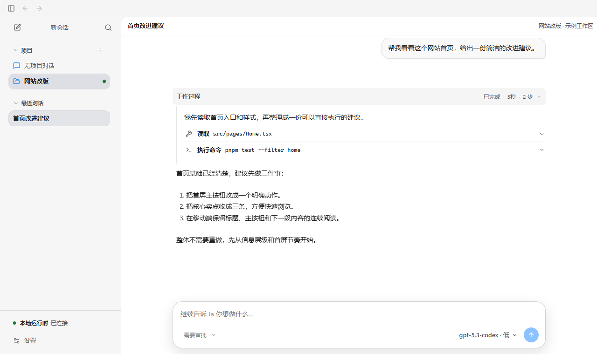
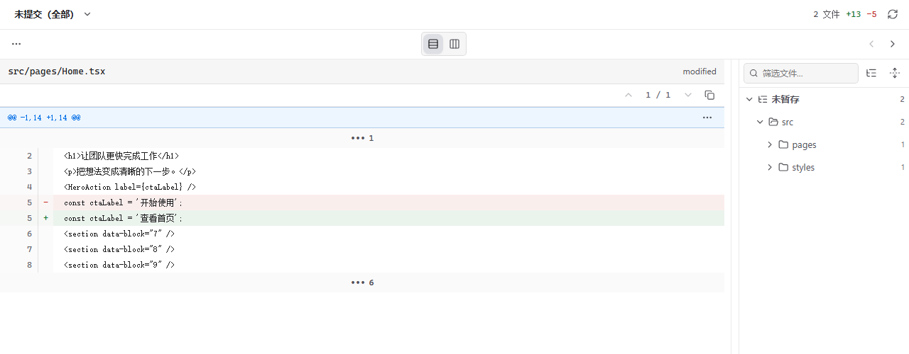

<!-- @author kongweiguang -->

<div align="center">
  
  <h1>Ja · 驾</h1>
  <p><strong>把想法交给 Agent，把过程和结果留在眼前。</strong></p>
  <p>一个运行在你电脑上的 AI Agent 工作台。</p>
  <p>
    <a href="https://github.com/kongweiguang/Ja/releases/latest">下载安装</a> ·
    <a href="#开始使用">开始使用</a> ·
    <a href="https://github.com/kongweiguang/Ja/issues">反馈建议</a>
  </p>
  <p><sub>Windows 11 · macOS Intel / Apple Silicon · 开源</sub></p>
</div>



Ja 可以帮你读懂项目、修改代码、整理文档、执行命令。你用自然语言说明想做什么，它在本地工作区里动手；执行过程可以查看，方向可以随时补充，完成后再一起检查结果。

*截图使用当前界面与示例内容，不包含真实用户对话或密钥。*

## 从一句话，到一件事做完

**说清你想做什么。** 直接聊天，或打开一个项目。把相关文件、图片带进对话，让 Agent 获得上下文。

> “先读一下这个项目，告诉我怎样运行，暂时不要修改文件。”
>
> “给这个页面加一个搜索框，保持现有风格，完成后运行测试。”
>
> “把这份文档整理成一页说明，面向第一次使用的人。”

**看着它推进。** 阅读执行说明，展开工具记录查看细节。需要时补充要求、处理执行确认，或停止当前任务。复杂任务也可以输入 `/plan`，先确认方案，再执行。

**检查，再继续。** 在对话里阅读结果、查看本轮修改；点击回复中的文件路径，可在当前会话的右栏阅读代码或打开本地 HTML、图片、PDF 等页面；在 Windows 上按住 Ctrl 点击，或聚焦路径后按 Ctrl+Enter，则在文件资源管理器中打开该文件所在的文件夹并选中它。右栏浏览器支持多个页面标签、地址栏、前进、后退和刷新，也能预览网页；还可以检查文件差异、在终端运行项目。不满意，就接着说哪里需要调整。



## 你的模型，你的工作方式

- **自由接入模型**：支持 Anthropic Messages、OpenAI Chat Completions 和 OpenAI Responses 接口，使用你自己的服务地址与 API Key。
- **一个窗口完成协作**：对话、文件编辑、代码审查、终端和网页预览放在一起；不同会话保留各自的工作台。
- **按需扩展**：用 Skills 提供可复用的做事方法，用 MCP 接入更多工具。
- **长任务有落点**：用 `/goal` 设置持续目标，通过计划确认步骤，也可以用子任务分担独立工作。

## 开始使用

### 1. 安装 Ja

从 [最新版本](https://github.com/kongweiguang/Ja/releases/latest) 下载适合设备的安装包：

| 设备 | 安装包文件名结尾 |
| --- | --- |
| Windows 11 · x64 | `windows_x86_64-setup.exe` |
| Mac · Apple Silicon | `darwin_aarch64.dmg` |
| Mac · Intel | `darwin_x86_64.dmg` |

安装版已包含运行环境，不需要自行安装 Java、Rust 或 Node.js。

当前安装包未使用系统签名证书，首次打开可能出现 SmartScreen 或 macOS 安全提示；应用更新仍验证独立的更新签名。Ja 目前是预览版本，重要项目请先做好备份。

### 2. 接入你的模型

打开 **设置 → 模型 → 新增供应商**，填写 API 规范、Base URL 和 API Key，在同一表单中添加一个或多个模型。每个模型填写真实上游标识，可设置显示名称、上下文与最大输出额度；推荐预算需要手动应用，也可自定义。保存后选择要使用的模型，后续通过“编辑供应商”继续添加或调整。连接不通时，可以用“验证模型”检查配置。

Ja 不要求注册账号。模型服务由你选择，请求费用由对应服务商收取。

### 3. 开始第一段对话

选择“无项目对话”，或在左侧添加本地项目，然后输入你的需求。初次尝试建议先让它只读分析，熟悉后再允许修改文件、执行命令。

输入框中的执行确认选项决定工具是否需要你逐次批准。选择“完全访问”时，Agent 可以直接使用当前用户的文件与命令权限。

### 命令行客户端（Windows x64）

仓库内提供独立的 `ja` 命令行客户端。它和 `ja-desktop` 连接同一个本机 App Server，共享模型配置与会话；退出界面不会取消正在运行的任务。Windows x64 npm 包 `@kongweiguang/ja` 目前处于发布前验证，尚未公开；发布后需要 Node.js 24.x，不需要另装 JDK。发布前的本地打包与安装说明见 [`packages/ja-npm/PUBLISHING.md`](packages/ja-npm/PUBLISHING.md)。

```text
ja                         # 在当前目录开始交互会话
ja -C <目录>                # 在指定目录开始会话
ja resume [thread-id]       # 恢复已有会话
ja exec "任务内容"           # 非交互执行，只向 stdout 输出最终回答
ja exec --json "任务内容"    # 输出带终态的版本化 JSONL 事件
ja server status            # 查看本机后台状态
```

交互界面使用 `/` 查找命令、`@` 引用文件；`Ctrl+J` 换行，`Ctrl+D` 在输入为空时退出。首次运行会引导配置模型。需要审批或澄清时，非交互命令会返回会话标识，供交互界面或桌面继续处理。

## 数据留在哪里？

对话记录、配置和附件默认保存在本机的 `~/.ja`（Windows 为 `%USERPROFILE%\.ja`）。调用模型时，相关对话与附件会发送到你配置的模型服务；MCP 和浏览器也会按你的配置访问外部服务。

密钥保存后不会在界面回显。分享截图或报告问题时，请避开密钥和私有内容。

## 关于 Ja

“驾”取驾驭之意：驾驭 Agent Harness，也掌握任务的方向。Ja 的核心 Harness 由 **Java 25 + Solon** 实现，桌面界面使用 **Tauri + React**。

想参与开发？从 [贡献指南](CONTRIBUTING.md) 开始。遇到问题，请在 [Issues](https://github.com/kongweiguang/Ja/issues) 留下版本、系统和复现步骤；安全问题见 [SECURITY.md](SECURITY.md)。

Ja 以 [GPL-3.0-or-later](LICENSE) 开源。
